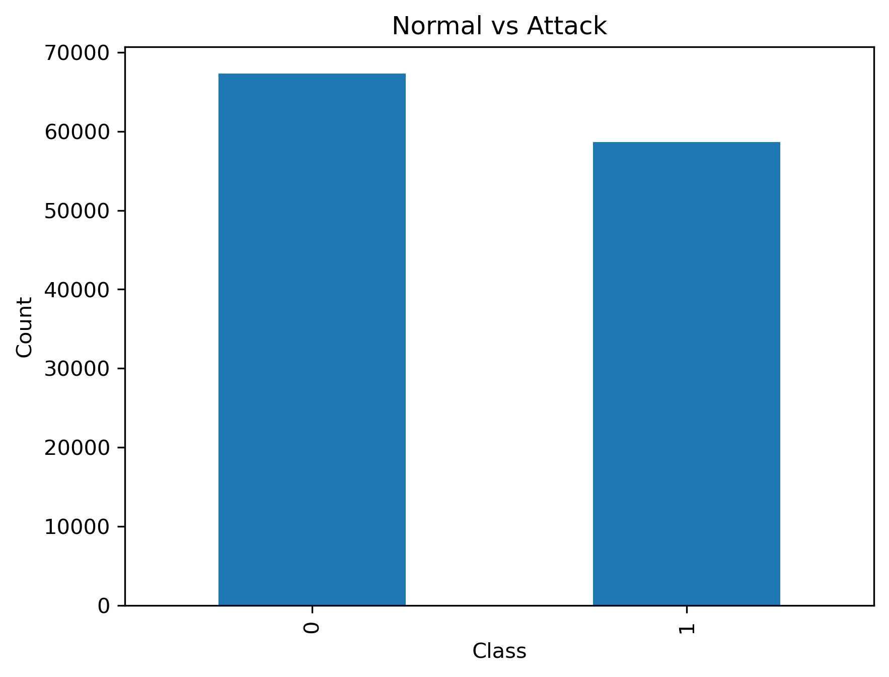
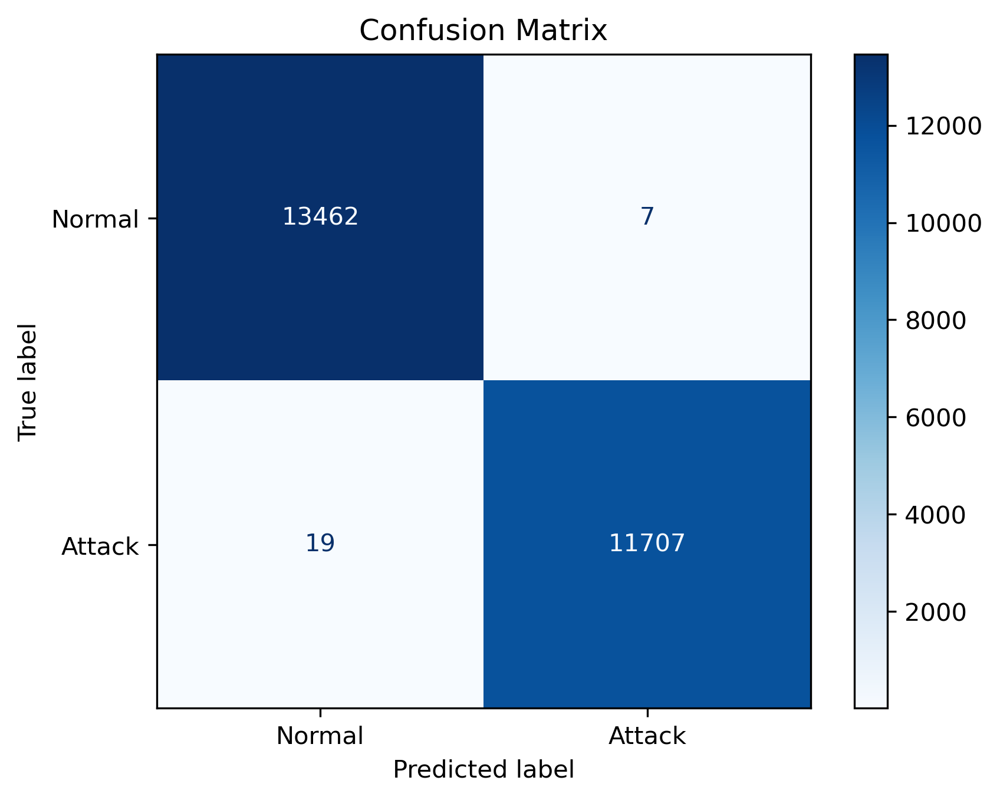
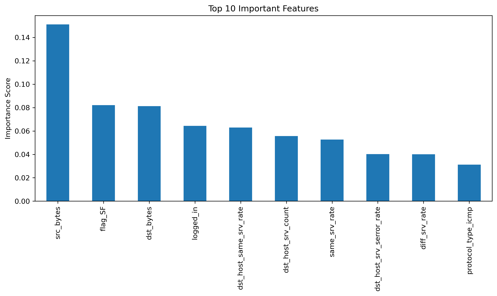
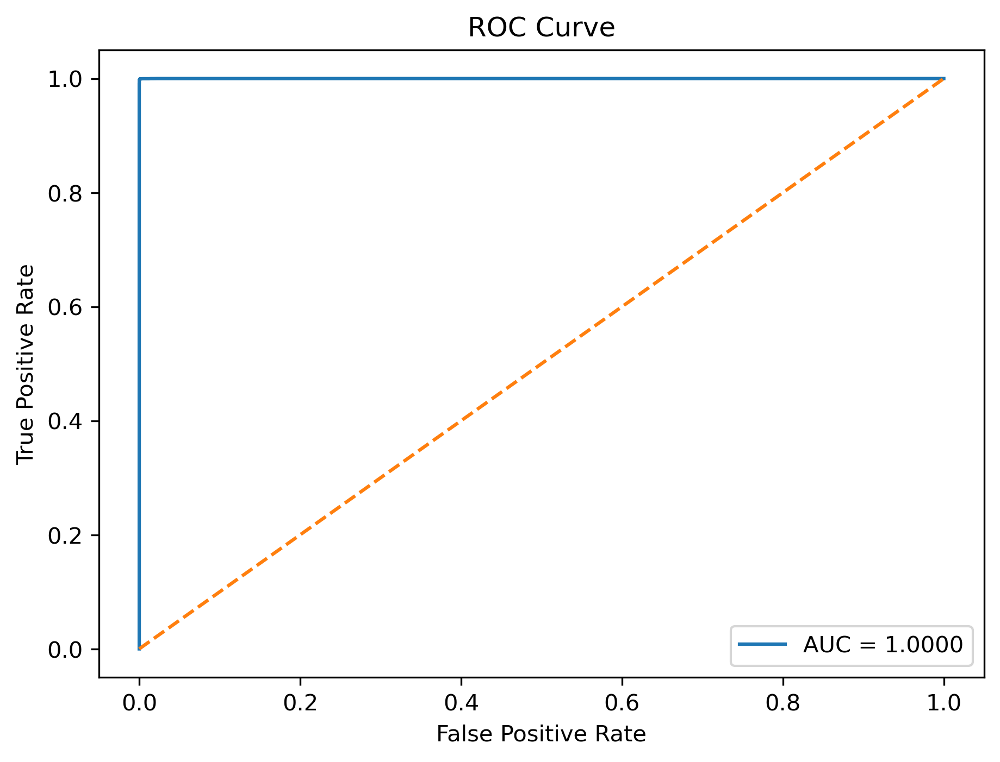

#  Network Intrusion Detection using Machine Learning


---

##  Project Overview

This project applies Machine Learning techniques to detect normal and malicious network traffic.

The system classifies network connections into attack or normal classes using supervised learning algorithms.

---

## Dataset

NSL-KDD Dataset

https://www.kaggle.com/datasets/hassan06/nslkdd

Dataset contains

- Network Traffic Records
- Attack Labels
- Normal Traffic
- Multiple Network Features

---

## Technologies

- Python
- Pandas
- NumPy
- Matplotlib
- Scikit-learn
- XGBoost
- Joblib

---

## Workflow

```
Dataset

↓

Data Cleaning

↓

Encoding

↓

Train/Test Split

↓

Random Forest

↓

XGBoost

↓

Evaluation

↓

Feature Importance

↓

ROC Curve

↓

Save Model
```

---

## Models

- Random Forest
- XGBoost

---

## Evaluation Metrics

- Accuracy
- Precision
- Recall
- F1 Score
- Confusion Matrix
- ROC Curve

---

## Results

The models successfully classify normal and attack traffic with high accuracy.

---

## Images

### Class Distribution



---

### Confusion Matrix



---

### Feature Importance



---

### ROC Curve



---

## Repository Structure

```
Network-Intrusion-Detection-ML

│

├── dataset

├── images

├── intrusion_detection.ipynb

├── model.pkl

├── xgboost_model.pkl

├── requirements.txt

├── README.md

└── LICENSE
```

---

## Installation

```bash
git clone https://github.com/AKK-NITRR/Network-Intrusion-Detection-ML.git
```

```bash
pip install -r requirements.txt
```

Run

```bash
jupyter notebook intrusion_detection.ipynb
```

---

## Future Work

- SHAP Explainable AI
- Deep Learning Models
- Real-time Intrusion Detection
- Streamlit Dashboard
- Hyperparameter Tuning

---

## Author

Aman Khare

AI | Machine Learning | Cybersecurity
